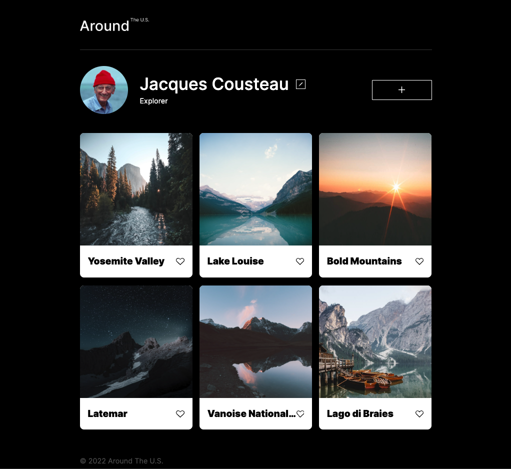

# Project 3: Around The U.S.

## Description
This project is a fully styled webpage featuring various UI components like cards, headers, footers, and profile sections. The project utilizes HTML and CSS to create a visually appealing and functional design.

## View

## Technology Used  

* HTML  
* CSS  
* FIGMA  
  
  
**Figma**  
  
* [Link to the project on Figma](https://www.figma.com/file/ii4xxsJ0ghevUOcssTlHZv/Sprint-3%3A-Around-the-US?node-id=0%3A1)  

**Deployment**
* gu[Link to live project](brosmar18.github.io/se_project_aroundtheus/)
  

